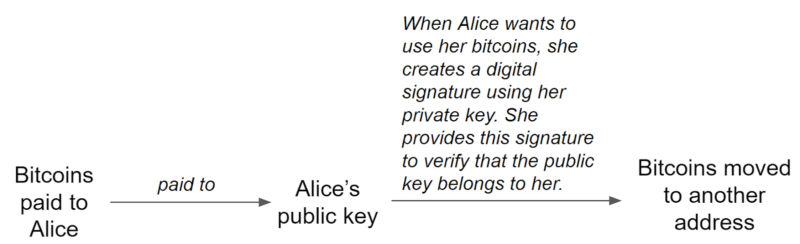
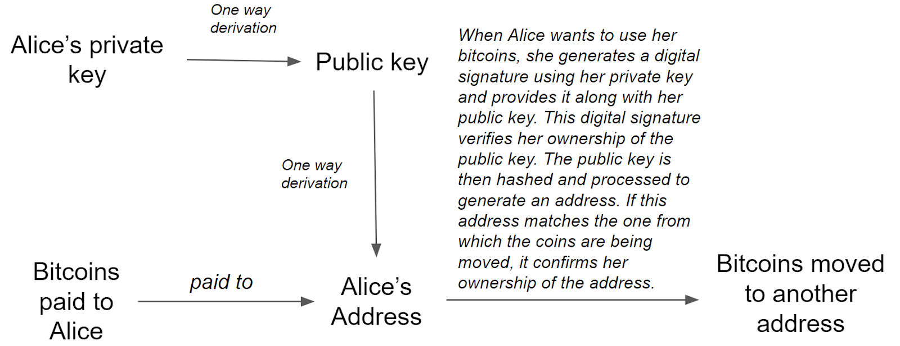
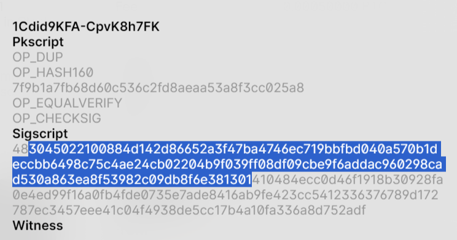
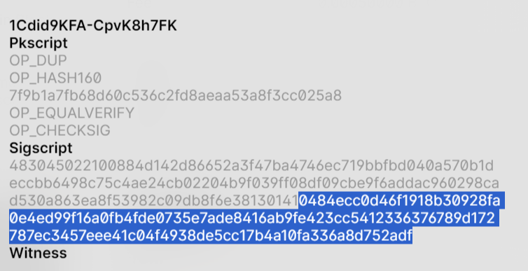

# Bitcoin Ownership & Use

## Introduction 

The best way for us to learn about Bitcoin is to understand how it addresses two fundamental requirements of a digital currency: confirming rightful ownership of currency and disallowing double spending. To explore these concepts, we will consider a simple scenario in which Alice wishes to repay Bob using a certain number of bitcoins. Our first task is to confirm that Alice actually owns the bitcoins she intends to use.

## First requirement for digital currency: Confirming rightful ownership 

We cannot allow Alice to pay Bob with funds that belong to someone else, so we must determine how to verify her ownership. To understand how this might work, consider a more familiar situation. Suppose you need to send a music file to Alice and want to ensure that only she can operate it—whether by opening it or listening to it. Using what we know from cryptography, we can encrypt the file with her public key and send it to her. When she attempts to use the file, she must provide a digital signature, which only she can generate because it requires her private key. Once her digital signature is validated, she is permitted to operate the file. In this way, ownership is granted by transferring the file to her public key, and ownership is confirmed by requiring a valid digital signature that corresponds to that key.

A similar approach applies to bitcoins. Ownership is established by transferring bitcoins to Alice’s public key. To use those bitcoins, she must generate a digital signature using her private key, and that signature can be verified by the public key to which the bitcoins were assigned. No one else can create a verifiable signature for that public key, ensuring that Alice alone is recognized as the rightful owner and preventing anyone else from spending her bitcoins.

### Asymmetric keys to the rescue 

In Bitcoin, ownership is conveyed by transferring bitcoins to Alice’s public key. To operate or spend these bitcoins, she must produce a digital signature using her private key. This signature is then validated using the public key associated with the transfer. Because no one except Alice possesses the private key needed to produce such a signature, no other party can generate a valid signature on her behalf. This process securely establishes her ownership while preventing unauthorized use.

Once her ownership is confirmed, Alice can repay Bob by transferring the corresponding amount to Bob’s public key. The transfer implicitly states that whoever can produce a digital signature verifiable by Bob’s public key is allowed to operate those bitcoins. The idea is summarized in the diagram shown above.

<figure><figcaption></figcaption></figure>

In summary, Alice’s ownership of bitcoins is verified by examining how they were transferred and ensuring they were sent to a public key that corresponds to the digital signature she can produce. Through this mechanism, the system confirms rightful ownership while preventing others from spending the same funds.

### From keys to a Bitcoin address 

A few clarifications are important at this stage. Although we have been speaking of bitcoins being transferred to Alice’s public key, in practice the funds are sent to her Bitcoin address. This does not contradict our earlier explanation because the public key and the Bitcoin address are closely connected. A Bitcoin address is derived from the public key through a long sequence of transformations. For a graphical explanation of how private and public keys are generated and how these transformations ultimately produce a Bitcoin address, one may consult the Royal Fork blog[1](http://royalforkblog.github.io/2014/08/11/graphical-address-generator/). A detailed description of the transformation steps is also available on the referenced site[2](https://en.bitcoin.it/wiki/Technical_background_of_version_1_Bitcoin_addresses).

If we examine the process more broadly, it becomes clear that Alice’s private key ultimately determines her Bitcoin address. This relationship arises because the elliptic curve cryptography (ECC) used in the Bitcoin protocol derives the public key directly from the private key. A similar dependence exists in the RSA algorithm, although the mechanics differ. In RSA, two large prime numbers, (p) and (q), are chosen randomly, and the private key is constructed from them; their product, (n), forms the basis of the public key. Despite these algorithmic differences, what is common across cryptographic systems is that it is not feasible to reverse-engineer a Bitcoin address to recover the public key.

### Summary of how Alice claims ownership of her bitcoins 

<figure><figcaption></figcaption></figure>

### Loss of keys 

What if you lose your keys? Since the public key is derived from the private key, a more appropriate question here is: what if you lose your private key?

If you lose your private key, then you cannot operate the bitcoins sent to the address associated with that private key. In other words, you have lost those bitcoins unless you can regenerate your private key.

#### Regeneration of keys 

Is there a way to regenerate your keys? Your keys are typically generated by wallets. Broadly speaking, there are two types of wallets: non-deterministic and deterministic. Depending on the type of wallet that you use, you may be able to regenerate the keys.

**Non-deterministic wallets**

Non-deterministic wallets generate a new key pair (i.e., a pair of private and public keys) randomly. It is extremely unlikely for these wallets to generate the same pair again. Therefore, if you have a non-deterministic wallet and you lose your private key, then the bitcoins received at the address associated with that key are lost as well.

**Deterministic wallets**

These generate key pairs from a seed that you provide to them. They can generate a near infinite number of key pairs from a single seed. As long as you remember the seed, the key pairs that were generated earlier can be generated again. They follow a particular process for key generation and, therefore, by following that process again, the previously generated key pairs are regenerated in the same sequence as before.

#### What is a seed like? 

A seed takes the form of a twelve-word phrase selected randomly from a dictionary of 2,048 words[3](https://en.bitcoin.it/wiki/Seed_phrase), and many wallets use mnemonic codes to generate this phrase[4](https://github.com/bitcoin/bips/blob/master/bip-0039.mediawiki#Generating_the_mnemonic). An example of such a seed phrase is:

**fun usual permit cement paddle section ridge okay crush sudden canvas depth**

The order of words in the seed phrase is crucial. One might imagine that this phrase could be guessed easily, allowing someone to gain access to the associated keys, but it is important to understand how difficult such guessing truly is. Anyone attempting to discover the correct seed phrase would need to rely on brute force, and on average, they would have to attempt half of all possible phrases before arriving at the correct one. The total number of possible twelve-word phrases is determined by the fact that each of the twelve positions can be filled by any of the 2,048 allowed words. Thus, the number of possible combinations is 2048^12.

Another way to see this is by following the step-by-step combinatorial method learned earlier.

| 
Calculation of total possible seed phrases

 First put down 12 spaces, one for each word

  

Then consider the first space. Write down the number of possibilities for filling that space. It equals 2048. 

 

Then consider the second space. Write down the number of possibilities for filling that space. That, again, is 2048.

 

In a similar way, fill up all the spaces with possibilities for each space.

 

To obtain the total number of possibilities for something that is 12 spaces long, just multiply the possibilities for each space. 

Therefore, we get: 2048 x 2048 x 2048 x 2048 x 2048 x 2048 x 2048 x 2048 x 2048 x 2048 x 2048 x 2048 

This is equal to 2048^12 Since 2048 equals 2^11, 2048^12 equals (2^11)^12 or 2^132 

Practice exercise-

What if you had 12 spaces and each space could be filled with a letter of the English alphabet, with both upper and lower cases being acceptable? 

 

The total number of possibilities would be 52^12. 

In a nutshell: 
<ul><li>First put down the spaces that need to be filled; </li><li>Then consider the possibilities for each of the spaces; </li><li>Lastly, multiply the possibilities in each space to get the total possibilities.</li></ul> |
| ------------------------------------------------------------------------------------------------------------------------------------------------------------------------------------------------------------------------------------------------------------------------------------------------------------------------------------------------------------------------------------------------------------------------------------------------------------------------------------------------------------------------------------------------------------------------------------------------------------------------------------------------------------------------------------------------------------------------------------------------------------------------------------------------------------------------------------------------------------------------------------------------------------------------------------------------------------------------------------------------------------------------------------------------------------------------------------------------------------------------------------------------------------------------------------------------------------------------------------------------------------------------------------------------------------------------------------------------------------------------------------------------------------------------------------------------------------------------------------------------------------------------------------------------------------------------------------------------------------------------------------------------------------------------------------------------------------------------------------------------------------------------------------------------------------------------------------------------------------------------------------------------------------------------------------------------------------------------------------------------------------------------------------------------------------------------------------------------------------------------------------------------------------------------------------------------------------------------------------------------------------------------------------------------------------------------------------------------------------------------------------------------------------------------------------------------------------------------------------------------------------------------------------------------------------------------------------------------------------------------------------------------------------------------------------------------------------------------------------------------------------------------------------------------------------------------------------------------------------------------------------------------------------------------------------------------------------------------------------------------------------------------------------------------------------------------------------------------------------------------------------------------------------------------------------------------------------------------------------------------------------------------------------------------------------------------------------------------------------------------------------------------------------------------------------------------------------------------------------------------------------------------------------------------------------------------------------------------------------------------------------------------------------------------------------------------------------------------------------------------------------------------------------------------------------------------------------------------------------------------------------------------------------------------------------------------------------------------------------------------------------------------------------------------------------------------------------------------------------------------------------------------------------------------------------------------------------------------------------------------------------------------------------------------------------------------------------------------------------------------------------------------------------------------------------------------------------------------------------------------------------------------------------------------------------------------------------------------------------------------------------------------------------------------------------------------------------------------------------------------------------------------------------------------------------------------------------------------------------------------------------------------------------------------------------------------------------------------------------------------------------------------------------------------------------------------------------------------------------------------------------------------------------------------------------------------------------------------------------------------------------------------------------------------------------------------------------------------------------------------------------------------------------------------------------------------------------------------------------------------------------------------------------------------------------------------------------------------------------------------------------------------------------------------------------------------------------------------------------------------------------------------------------------------------------------------------------------------------------------------------------------------------------------------------------------------------------------------------------------------------------------------------------------------------------------------------------------------------------------------------------------------------------------------------------------------------------------------------------------------------------------------------------------------------------------------------------------------------------------------------------------------------------------------------------------------------------------------------------------------------------------------------------------------------------------------------------------------------------------------------------------------------------------------------------------------------------------------------------------------------------------------------------------------------------------------------------------------------------------------------------------------------------------------------------------------------------------------------------------------------------------------------------------------------------------------------------------------------------------------------------------------------------------------------------------------------------------------------------------------------------------------------------------------------------------------------------------------------------------------------------------------------------------------------------------------------------------------------------------------------------------------------------------------------------------------------------------------------------------------------------------------------------------------------------------------------------------------------------------------------------------------------------------------------------------------------------------------------------------------------------------------------------------------------------------------------------------------------------------------------------------------------------------------------------------------------------------------------------------------------------------------------------------------------------------------------------------------------------------------------------------------------------------------------------------------------------------------------------------------------------------------------------------------------------------------------------------------------------------------------------------------------------------------------------------------------------------------------------------------------------------------------------------------------------------------------------------------------------------------------------------------------------------------------------------------------------------------------------------------------------------------------------------------------------------------------------------------------------------------------------------------------------------------------------------------------------------------------------------------------------------------------------------------------------------------------------------------------------------------------------------------------------------------------------------------------------------------------------------------------------------------------------------------------------------------------------------------------------------------------------------------------------------------------------------------------------------------------------------------------------------------------------------------------------------------------------------------------------------------------------------------------------------------------------------------------------------------------------------------------------------------------------------------------------------------------------------------------------------------------------------------------------------------------------------------------------------------------------------------------------------------------------------------------------------------------------------------------------------------------------------------------------------------------------------------------------------------------------------------------------------------------------------------------------------------------------------------------------------------------------------------------------------------------------------------------------------------------------------------------------------------------------------------------------------------------------------------------------------------------------------------------------------------------------------------------------------------------------------------------------------------------------------------------------------------------------------------------------------------------------------------------------------------------------------------------------------------------------------------------------------------------------------------------------------------------------------------------------------------------------------------------------------------------------------------------------------------------------------------------------------------------------------------------------------------------------------------------------------------------------------------------------------------------------------------------------------------------------------------------------------------------------------------------------------------------------------------------------------------------------------------------------------------------------------------------------------------------------------------------------------------------------------------------------------------------------------------------------------------------------------------------------------------------------------------------------------------------------------------------------------------------------------------------------------------------------------------------------------------------------------------------------------------------------------------------------------------------------------------------------------------------------------------------------------------------------------------------------------------------------------------------------------------------------------------------------------------------------------------------------------------------------------------------------------------------------------------------------------------------------------------------------------------------------------------------------------------------------------------------------------------------------------------------------------------------------------------------------------------------------------------------------------------------------------------------------------------------------------------------------------------------------------------------------------------------------------------------------------------------------------------------------------------------------------------------------------------------------------------------------------------------------------------------------------------------------------------------------------------------------------------------------------------------------------------------------------------------------------------------------------------------------------------------------------------------------------------------------------------------------------------------------------------------------------------------------------------------------------------------------------------------------------------------------------------------------------------------------------------------------------------------------------------------------------------------------------------------------------------------------------------------------------------------------------------------------------------------------------------------------------------------------------------------------------------------------------------------------------------------------------------------------------------------------------------------------------------------------------------------------------------------------------------------------------------------------------------------------------------------------------------------------------------------------------------------------------------------------------------------------------------------------------------------------------------------------------------------------------------------------------------------------------------------------------------------------------------------------------------------------------------------------------------------------------------------------------------------------------------------------------------------------------------------------------------------------------------------------------------------------------------------------------------------------------------------------------------------------------------------------------------------------------------------------------------------------------------------------------------------------------------------------------------------------------------------------------------------------------------------------------------------------------------------------------------------------------------------------------------------------------------------------------------------------------------------------------------------------------------------------------------------------------------------------------------------------------------------------------------------------------------------------------------------------------------------------------------------------------------------------------------------------------------------------------------------------------------------------------------------------------------------------------------------------------------------------------------------------------------------------------------------------------------------------------------------------------------------------------------------------------------------------------------------------------------------------------------------------------------------------------------------------------------------------------------------------------------------------------------------------------------------------------------------------------------------------------------------------------------------------------------------------------------------------------------------------------------------------------------------------------------------------------------------------------------------------------------------------------------------------------------------------------------------------------------------------------------------------------------------------------------------------------------------------------------------------------------------------------------------------------------------------------------------------------------------------------------------------------------------------------------------------------------------------------------------------------------------------------------------------------------------------------------------------------------------------------------------------------------------------------------------------------------------------------------------------------------------------------------------------------------------------------------------------------------------------------------------------------------------------------------------------------------------------------------------------------------------------------------------------------------------------------------------------------------------------------------------------------------------------------------------------------------------------------------------------------------------------------------------------------------------------------------------------------------------------------------------------------------------------------------------------------------------------------------------------------------------------------------------------------------------------------------------------------------------------------------------------------------------------------------------------------------------------------------------------------------------------------------------------------------------------------------------------------------------------------------------------------------------------------------------------------------------------------------------------------------------------------------------------------------------------------------------------------------------------------------------------------------------------------------------------------------------------------------------------------------------------------------------------------------------------------------------------------------------------------------------------------------------------------------------------------------------------------------------------------------------------------------------------------------------------------------------------------------------------------------------------------------------------------------------------------------------------------------------------------------------------------------------------------------------------------------------------------------------------------------------------------------------------------------------------------------------------------------------------------------------------------------------------------------------------------------------------------------------------------------------------------------------------------------------------------------------------------------------------------------------------------------------------------------------------------------------------------------------------------------------------------------------------------------------------------------------------------------------------------------------------------------------------------------------------------------------------------------------------------------------------------------------------------------------------------------------------------------------------------------------------------------------------------------------------------------------------------------------------------------------------------------------------------------------------------------------------------------------------------------------------------------------------------------------------------------------------------------------------------------------------------------------------------------------------------------------------------------------------------------------------------------------------------------------------------------------------------------------------------------------------------------------------------------------------------------------------------------------------------------------------------------------------------------------------------------------------------------------------------------------------------------------------------------------------------------------------------------------------------------------------------------------------------------------------------------------------------------------------------------------------------------------------------------------------------------------------------------------------------------------------------------------------------------------------------------------------------------------------------------------------------------------------------------------------------------------------------------------------------------------------------------------------------------------------------------------------------------------------------------------------------------------------------------------------------------------------------------------------------------------------------------------------------------------------------------------------------------------------------------------------------------------------------------------------------------------------------------------------------------------------------------------------------------------------------------------------------------------------------------------------------------------------------------------------------------------------------------------------------------------------------------------------------------------------------------------------------------------------------------------------------------------------------------------------------------------------------------------------------------------------------------------------------------------------------------------------------------------------------------------------------------------------------------------------------------------------------------------------------------------------------------------------------------------------------------------------------------------------------------------------------------------------------------------------------------------------------------------------------------------------------------------------------------------------------------------------------------------------------------------------------------------------------------------------------------------------------------------------------------------------------------------------------------------------------------------------------------------------------------------------------------------------------------------------------------------------------------------------------------------------------------------------------------------------------------------------------------------------------------------------------------------------------------------------------------------------------------------------------------------------------------------------------------------------------------------------------------------------------------------------------------------------------------------------------------------------------------------------------------------------------------------------------------------------------------------------------------------------------------------------------------------------------------------------------------------------------------------------------------------------------------------------------------------------------------------------------------------------------------------------------------------------------------------------------------------------------------------------------------------------------------------------------------------------------------------------------------------------------------------------------------------------------------------------------------------------------------------------------------------------------------------------------------------------------------------------------------------------------------------------------------------------------------------------------------------------------------------------------------------------------------------------------------------------------------------------------------------------------------------------------------------------------------------------------------------------------------------------------------------------------------------------------------------------------------------------------------------------------------------------------------------------------------------------------------------------------------------------------------------------------------------------------------------------------------------------------------------------------------------------------------------------------------------------------------------------------------------------------------------------------------------------------------------------------------------------------------------------------------------------------------------------------------------------------------------------------------------------------------------------------------------------------------------------------------------------------------------------------------------------------------------------------------------------------------------------------------------------------------------------------------------------------------------------------------------------------------------------------------------------------------------------------------------------------------------------------------------------------------------------------------------------------------------------------------------------------------------------------------------------------------------------------------------------------------------------------------------------------------------------------------------------------------------------------------------------------------------------------------------------------------------------------------------------------------------------------------------------------------------------------------------------------------------------------------------------------------------------------------------------------------------------------------------------------------------------------------------------------------------------------------------------------------------------------------------------------------------------------------------------------------------------------------------------------------------------------------------------------------------------------------------------------------------------------------------------------------------------------------------------------------------------------------------------------------------------------------------------------------------------------------------------------------------------------------------------------------------------------------------------------------------------------------------------------------------------------------------------------------------------------------------------------------------------------------------------------------------------------------------------------------------------------------------------------------------------------------------------------------------------------------------------------------------------------------------------------------------------------------------------------------------------------------------------------------------------------------------------------------------------------------------------------------------------------------------------------------------------------------------------------------------------------------------------------------------------------------------------------------------------------------------------------------------------------------------------------------------------------------------------------------------------------------------------------------------------------------------------------------------------------------------------------------------------------------------------------------------------------------------------------------------------------------------------------------------------------------------------------------------------------------------------------------------------------------------------------------------------------------------------------------------------------------------------------------------------------------------------------------------------------------------------------------------------------------------------------------------------------------ |

Therefore, on average, the security of a seed phrase corresponds to the computational effort required to brute-force half of the 2^132 possible phrases. At first glance, this level of security appears even greater than that provided by a 128-bit symmetric key. However, a small portion of the final word in the seed phrase is reserved for an internal checksum generated by the wallet. When you reenter the seed phrase later, the wallet uses this checksum to verify correctness; even a single mistyped word causes the check to fail, preventing the wallet from silently generating an incorrect key set. Because part of the final word serves this error-checking purpose, the effective security aligns with that of a 128-bit symmetric key[4](https://github.com/bitcoin/bips/blob/master/bip-0039.mediawiki#Generating_the_mnemonic), which still represents a level of protection that would take more than a trillion years for the world’s fastest computers to brute-force.

#### What if you lose the seed phrase? 

If the seed phrase is lost, then the keys it generates cannot be recreated. Unless the private keys were stored elsewhere, any bitcoins associated with the addresses derived from those keys are permanently lost. For this reason, the seed phrase must be kept secure—typically written on paper and stored along with other valuables. While one could store the individual private keys themselves, most users rely on the seed phrase precisely so they do not need to store each key manually.

Some wallets also allow the user to add an optional passphrase in addition to the twelve-word seed[5](https://www.blockplate.com/blogs/blockplate/securing-your-bitcoin-wallet-recovery-seed-phrase). This passphrase functions like a “13th word,” and without it, the seed phrase alone cannot regenerate the keys. This provides an additional layer of security: even if someone discovers the twelve words, they still cannot access the wallet without the accompanying passphrase.

Wallet software may additionally request a local password to open the encrypted wallet file on a computer. This password protects only the local file—it does not protect or replace the seed phrase or the private keys. Popular news stories about “lost passwords” typically refer to this local file password rather than the seed phrase itself. Depending on how such passwords were generated, they can sometimes be recovered. In one well-known case, a hacker successfully recovered a lost password because it had been created by a password manager based on the system’s date and time. By testing a large range of possible date-and-time combinations, the hacker eventually succeeded, enabling the wallet’s owner to recover $3 million worth of bitcoin[6](https://www.wired.com/story/roboform-password-3-million-dollar-crypto-wallet/).

### How do addresses come into play in a transaction? 

To understand how addresses function within a transaction, let us explore a set of transactions discussed in _Mastering Bitcoin_, illustrated in the figure above. We will examine these transactions directly on the Bitcoin blockchain by following a simple exercise.

<figure><figcaption></figcaption></figure>

When you visit the transaction[7](https://www.blockchain.com/btc/tx/7957a35fe64f80d234d76d83a2a8f1a0d8149a41d81de548f0a65a8a999f6f18) in which Alice receives 0.1 BTC from Joe—the first transaction shown in the figure—you will notice that no real-world names appear anywhere. Transactions list only addresses, not identities. Whether an address can be linked back to a real individual depends largely on the type of exchange someone uses when buying or redeeming bitcoins. There are two broad categories of exchanges: peer-to-peer (P2P) and non–peer-to-peer. In a non–peer-to-peer exchange, the presence of a third party requires users to provide identifying information to claim ownership of purchased bitcoins or to receive payment for bitcoins sold. Know Your Customer (KYC) regulations also require such identification in many countries.

In contrast, some P2P exchanges—particularly those outside the United States—may not require KYC information. In such environments, users may remain anonymous when buying or redeeming bitcoins with local currency, provided they use tools such as the TOR network to mask their internet activity[8](https://www.bitdegree.org/crypto/tutorials/anonymous-bitcoin-wallet),[9](https://99bitcoins.com/buy-bitcoin/anonymously-without-id/). Within the U.S., however, P2P exchanges are now subject to financial regulation, meaning KYC and Anti-Money Laundering (AML) rules apply. There was a time when U.S.-based P2P exchanges did not require KYC, and the following example, originally drafted with ChatGPT’s help and refined for clarity, shows how anonymity was once achieved.

| 
Method with Escrow and Prepaid Gift Cards 
<ol><li> Purchase Gift Cards Anonymously: Buy prepaid gift cards (e.g., Visa or Mastercard gift cards) with cash from a retail store to avoid sharing personal information. </li><li> Find a Seller Who Accepts Gift Cards: On the P2P exchange, find a seller who agrees to accept prepaid gift cards as payment for bitcoin and make sure the platform uses an escrow service. </li></ol>
To be anonymous on a P2P exchange, I must do the following: 
<ul><li>The account I set up on the P2P exchange should not give away my identity (e.g., username should not be tied to your name or username elsewhere). </li><li>Additionally, I should not give away my identity when interacting via the internet with the exchange, either during account creation or when using it. </li></ul>
I can reasonably ensure the above by using TOR. TOR routes my traffic through three relays before it reaches the exchange, which hides my real Internet address and makes it very hard to trace activity back to me (see figure <a href="https://unit42.paloaltonetworks.com/wp-content/uploads/2022/08/word-image-91.png">10</a> and related article<a href="https://unit42.paloaltonetworks.com/tor-traffic-enterprise-networks/">11</a>). 

If an email is needed (e.g., to create an account on the P2P exchange), I should use a provider of anonymous email accounts <a href="https://nordvpn.com/blog/free-anonymous-email-account/?srsltid=AfmBOooAE7Q94GoczWCgQp0cq8EINQHSNKO14k4T7mYAG_7uuc8wMB3s">12</a> and make sure that the username is not tied to my name or any other username of mine. I should use TOR when I create the email account and every time I log into it, so the account is never tied to my normal Internet connection. 

Using TOR alone, however, is not enough. When using TOR for activities related to the P2P exchange, I must also avoid leaking personal information. That means not logging into personal accounts, not giving a phone number that can identify me, and not reusing usernames or details that can connect this activity to my real identity. 

By routing your traffic via a VPN, you add an additional layer of challenge for whoever wants to track you. 
<ol start="3"><li> Start the Trade: Once you initiate the trade, the seller’s bitcoin is held in escrow by the P2P platform. This ensures the seller can’t withdraw the bitcoin while the transaction is in progress. </li><li> Share Card Details with the Seller: Provide the seller with the gift card information (card number, expiration date, CVV). </li><li>Wait for Verification: The seller will check the gift card balance to confirm payment. Once the seller verifies that the card is valid and funded, they notify the platform. </li><li>Release from Escrow: The P2P platform then releases the bitcoin from escrow to your wallet, completing the transaction. </li></ol>
By using the escrow service, you’re protected from the risk of the seller not delivering the bitcoin after you’ve shared the gift card details.
 |
| ----------------------------------------------------------------------------------------------------------------------------------------------------------------------------------------------------------------------------------------------------------------------------------------------------------------------------------------------------------------------------------------------------------------------------------------------------------------------------------------------------------------------------------------------------------------------------------------------------------------------------------------------------------------------------------------------------------------------------------------------------------------------------------------------------------------------------------------------------------------------------------------------------------------------------------------------------------------------------------------------------------------------------------------------------------------------------------------------------------------------------------------------------------------------------------------------------------------------------------------------------------------------------------------------------------------------------------------------------------------------------------------------------------------------------------------------------------------------------------------------------------------------------------------------------------------------------------------------------------------------------------------------------------------------------------------------------------------------------------------------------------------------------------------------------------------------------------------------------------------------------------------------------------------------------------------------------------------------------------------------------------------------------------------------------------------------------------------------------------------------------------------------------------------------------------------------------------------------------------------------------------------------------------------------------------------------------------------------------------------------------------------------------------------------------------------------------------------------------------------------------------------------------------------------------------------------------------------------------------------------------------------------------------------------------------------------------------------------------------------------------------------------------------------------------------------------------------------------------------------------------------------------------------------------------------------------------------------------------------------------------------------------------------------------------------------------------------------------------------------------------------------------- |

Now scroll to the “Overview” section of the transaction page. You will see that 0.1 BTC was transferred from address 18iWVBbk8tA9bbipS1evviVLP4eE5ga51P. The transaction includes one input and one output. The input section, labeled “From,” shows a single address—Joe’s—contributing the bitcoins used in this transaction. Joe received these bitcoins in an earlier transaction. By clicking the black circle with the left arrow under “From,” you can navigate to the transaction in which Joe originally received the 0.10 BTC. On this new page, you can see the address that paid Joe (1B9DY62qqYdRdsM6DhuL5Hh9ZQSGXCymk2). You may continue clicking the left arrow to trace the flow of bitcoins through earlier hands, or use the right arrow under the “To” section to return to the transaction where Joe pays Alice. Through this process, it becomes apparent that every transaction is part of a chain that can be navigated to determine the origin of any particular set of bitcoins.

Returning to the original transaction[7](https://www.blockchain.com/btc/tx/7957a35fe64f80d234d76d83a2a8f1a0d8149a41d81de548f0a65a8a999f6f18)—the one in which Alice receives 0.1 BTC from Joe—go again to the “Overview” section. If you now click the right arrow in the “To” area, you will be taken to the second transaction shown in the figure. This is where Alice spends the 0.10 BTC she received from Joe in order to pay Bob.

In this transaction, 0.015 BTC is sent to address 1GdK9UzpHBzqzX2A9JFP3Di4weBwqgmoQA (Bob’s address). The remaining 0.0845 BTC is sent to address 1Cdid9KFAaatwczBwBttQcwXYCpvK8h7FK, which is Alice’s change address. Bitcoin requires that the entire output of a previous transaction be spent in a new transaction. If the output exceeds the amount the user wants to pay, the user sends the difference back to themselves as change. Although one might expect Alice to keep 0.085 BTC (0.10 minus 0.015), she actually retains only 0.0845 BTC. The difference—0.00050000 BTC—is the transaction fee paid to the miner who verifies and records the transaction. This fee is voluntary but practically necessary; without it, a transaction is unlikely to be processed in a timely manner.

In the summary view, you will notice that there are no right arrows next to the outputs of 0.01500000 BTC and 0.08450000 BTC. This means these outputs remain unspent. The figure in the book suggests that the 0.015 BTC sent to Bob was spent, but according to blockchain data, it remains unspent to this day.

| The 0.01500000 BTC given to Bob and 0.08450000 BTC given to Alice’s change address remain unspent to date. The figure from the book suggests that the 0.01500000 BTC given to Bob was spent. That is not the case. |
| ------------------------------------------------------------------------------------------------------------------------------------------------------------------------------------------------------------------ |

### The use of keys in enabling a transaction 

Let us briefly recap the steps needed to confirm that Alice is indeed the rightful owner of the bitcoins she is attempting to pay Bob, while also adding new details to clarify what happens during a Bitcoin transaction. When Alice originally received the bitcoins she now wants to spend, they were sent to her address. When she later decides to spend them, she creates a transaction[13](https://www.blockchain.com/btc/tx/0627052b6f28912f2703066a912ea577f2ce4da4caa5a5fbd8a57286c345c2f2) that specifies all relevant details. Inside this transaction[14](https://www.blockchain.com/explorer/transactions/btc/0627052b6f28912f2703066a912ea577f2ce4da4caa5a5fbd8a57286c345c2f2), she includes her digital signature. By clicking the “\</>” icon to the right of Alice’s address under the “From” section in the blockchain explorer, you can view the transaction scripts. The window titled Sigscript contains two components. The first part is the digital signature, beginning with 3045 and continuing through 1301.

<figure><figcaption></figcaption></figure>

A digital signature always requires a message. Just as in Mailvelope, where the message you typed was hashed to generate a message digest and then encrypted with your private key, Bitcoin follows a similar process. In Alice’s case, selected components of her transaction serve as the message. These components are hashed, and the resulting digest is encrypted using Alice’s private key, producing the digital signature that appears in Sigscript.

This digital signature can be verified only by Alice’s public key. However, Alice has not publicly posted her public key on any server; doing so would introduce centralized control, something the Bitcoin system explicitly avoids. Because a Bitcoin address is generated by hashing the public key, it is impossible to reverse the address to reconstruct the key. Therefore, to enable the verification of her signature, Alice includes her public key directly in Sigscript. The second portion of Sigscript—beginning with 0484ecc…—contains her public key.

<figure><figcaption></figcaption></figure>

At this point, several concerns may arise. One might wonder whether someone else could supply their own digital signature and public key to spend Alice’s bitcoins. Although their signature would verify correctly using their own public key, it would not be valid for Alice’s address. Since bitcoins were sent specifically to Alice’s address, only her public key, when hashed, produces that address. During transaction validation, the network checks that the provided public key hashes to the correct address. If it does not, the transaction is rejected.

Another concern is whether a third party, having seen Alice’s public key in Sigscript, could use it to spend any remaining unspent bitcoins belonging to her. This is not possible, because spending requires a valid digital signature, and digital signatures can only be produced with the corresponding private key. A third party might attempt to use an old digital signature of Alice’s, but that would fail as well. Any new transaction requires a signature produced from a message digest tied specifically to that transaction. The digest recovered from an old signature would not match a new transaction’s message digest, rendering the attempt invalid.

Once these concerns are addressed and Alice’s ownership is confirmed, her transaction is ready for processing. Portions of the spent bitcoins are then allocated to the designated output addresses, and any unallocated portion becomes the miner’s fee.

### Change address will most likely be different 

In the example where Alice pays Bob 0.015 BTC[13](https://www.blockchain.com/btc/tx/0627052b6f28912f2703066a912ea577f2ce4da4caa5a5fbd8a57286c345c2f2), she sends 0.08450000 BTC back to herself as change. Although this change was sent to the same address she originally used, best practice is to avoid doing so. Instead, it is recommended that wallets generate a new change address each time. Consider the transaction[15](https://www.blockchain.com/btc/tx/0a1c0b1ec0ac55a45b1555202daf2e08419648096f5bcc4267898d420dffef87) highlighted for this purpose. According to the Bitcoin Wiki[16](https://en.bitcoin.it/wiki/Change), the change amount of 0.89000000 BTC in that transaction is sent to address 1HPG2mhygVg2Dq48Gz26zLZaQaPtfZZntH. The entity spending 10.89 BTC originally controlled address 19fZubJbo1mCyfBjrP4srPpXAVbjag4vw6, but the change is directed to a newly generated address.

Why is it advisable not to send change back to the original address? When initiating a payment, your transaction includes both your digital signature and your public key. The public key serves as a starting point for any attacker attempting to derive your private key. While current computing capabilities make this infeasible, the future arrival of quantum computers could change this assumption. By generating a new address—along with a new key pair—for your change, your public key is not exposed during the payment. This significantly reduces long-term cryptographic risk.

Wallets make this process seamless by automatically generating new change addresses. Since Bitcoin supports an astronomically large number of possible addresses, there is no concern about running out. This practice aligns with the broader Bitcoin community recommendation of using a fresh receiving address for each new payment. The Bitcoin wiki[17](https://en.bitcoin.it/wiki/Address) provides an example explaining why reusing a single address—even as a merchant—can lead to confusion and vulnerability. If a merchant instructs all customers to send payments to a single address, then anyone observing the transaction on the public blockchain could impersonate the actual payer by supplying the same signature and public key included in the Sigscript. Because the merchant cannot distinguish between signatures in this scenario, each customer must instead be given a unique address.

### There can be more than one input in a transaction 

Because a user may hold bitcoins across multiple addresses, situations arise where the balance in a single address is insufficient to fund a transaction. In such cases, Bitcoin allows the spender to draw inputs from multiple addresses simultaneously. When examining the transaction at [18](https://www.blockchain.com/btc/tx/8ce84ba0a010cac62005f529780c79a26f4ddd591025453ae702673784eb1d8c), we observe more than one input being used. This indicates that a single entity, having previously received bitcoins at two different addresses, is now combining those funds to complete the current transaction. By scrolling to the input section, we can see that each input includes its own public key and digital signature—the encrypted message digest—corresponding to the address supplying that portion of the funds. It is also entirely possible for inputs in a transaction to come from different individuals; Bitcoin does not require all inputs to originate from the same person. Multiple independent entities can combine their inputs into a single transaction when needed.

### More about fees 

While transaction fees in Bitcoin are technically voluntary, they are essential for incentivizing miners. Without an included fee, a transaction is unlikely to be processed. Several considerations determine how fees work. First, fees are based on the size of the transaction in bytes, not on the value being transferred. Second, fees are dynamic and fluctuate with network congestion. Users may compute recommended fees either through their own algorithm or by relying on a third-party service. One such service is BTC Network[19](https://btc.network/estimate), which provides fee recommendations for different processing speeds.

By visiting **https://btc.network/estimate**, you can see current suggested fees.\
**Exercise 1** asks you to determine the recommended fee, in both BTC and USD, for the fastest confirmation given a transaction with one input and three outputs. Make sure the “Use Segwit” option is turned off. You can experiment by adjusting the number of inputs and outputs to observe how the estimated fee changes. You can also adjust the waiting time slider to see how different processing speeds affect the recommendation.

**Exercise 2** asks you to return to the original settings and enable Segwit. Segwit is an update to the Bitcoin protocol designed to allow more transactions per block, improve security, and effectively reduce transaction fees. Segwit accomplishes this by introducing the concept of virtual bytes—or vbytes. A transaction may occupy a certain number of actual bytes, but Segwit treats portions of the data differently and charges fees based on a smaller “virtual” size. A transaction requiring 226 bytes, for example, might be billed as if it were only 141 bytes. Since those 141 bytes are not literal data, they are called vbytes. Segwit is able to offer this discount because it relocates specific data fields and processes them separately from the main transaction structure. If desired, you can ask ChatGPT to explain Segwit and vbytes in more depth.

For a more advanced and dynamic view of network fees, you can visit **https://mempool.space/**. Keep in mind that the fees listed there are quoted in vbytes, and the site is much easier to understand if you already have a basic grasp of Segwit. For educational purposes, the BTC Network site used in the exercises remains the most straightforward resource.

## “Decentralization” in decentralized finance 

This section brings together the ideas covered so far to explain what “decentralization” means in decentralized finance. In the context of digital money, decentralization allows individuals to transact directly with one another without relying on an intermediary such as a bank or payment processor. Bitcoin enables this through cryptographic authentication: ownership is proven using asymmetric encryption keys and digital signatures. These mechanisms eliminate the need for a central authority to verify transactions, shifting trust from institutions to cryptographic proofs and the distributed network.

The same principle applies to other digital assets, such as stablecoins. Stablecoins are digital tokens pegged to a reference asset, often the U.S. dollar. Although a trusted entity is needed to issue the stablecoin and maintain its peg—usually by holding reserve assets—once the tokens exist on the blockchain, users can transfer them peer-to-peer just like bitcoin. Private keys and digital signatures authenticate each transfer, allowing stablecoins to circulate without the issuer or a financial intermediary needing to approve each movement.

Recent legislative proposals, such as the GENIUS Act (Guaranteeing Regulatory Oversight for New and Innovative Stablecoins), reflect policymakers’ attempts to regulate this hybrid model. The Act seeks to establish standards for the issuance and backing of stablecoins while recognizing that, after issuance, these tokens function in a decentralized manner. Regulation focuses on the creation and guarantee of the tokens, while the peer-to-peer transfers between users remain decentralized.

This structure demonstrates a new balance between regulatory oversight at the point of creation and decentralized operation afterward—a hallmark of blockchain-based finance.

## Second requirement for digital currency: Avoiding double spending 

Because bitcoins exist only as digital information—essentially sequences of 0s and 1s—there is nothing physically preventing someone like Alice from duplicating that information and attempting to spend the same bitcoins more than once. This is known as double spending, and the system must prevent it for Bitcoin to function as a viable currency. The next section will explore how Bitcoin addresses this second fundamental requirement for digital money.

##
