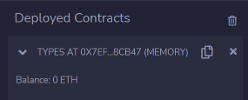

# Chapter 9

## **Global variables and units** <a href="#global-variables-and-units" id="global-variables-and-units"></a>

So far, we have looked at two types of variables, local and state variables. Solidity makes use of a third kind of variable -- global variables.

* These exist in the global workspace and are designed to provide information about the blockchain.
* They are referred to as global because they are available to all. No one has to define them beforehand but they can use it automatically.
* Solidity also provides units of time and ether. They are not global variables but they are available without anyone having to define them beforehand.

We cover these below.

### **Examples of global variables: msg.value and msg.sender** <a href="#examples-of-global-variables-msg.value-and-msg.sender" id="examples-of-global-variables-msg.value-and-msg.sender"></a>

We will learn about global variables like msg.value and msg.sender through hands-on exercises with contracts.

Until now, we have built several contracts that worked with different kinds of data – books, profits, and so on. However, we have not yet learned how to build a contract that can receive ETH. We did create a faucet earlier, but we simply copied the code without really understanding how a contract is able to accept ether. The following exercise will help us do that and provide a solid foundation for what comes next.

| <p>Exercise: Receiving donations</p><ol><li>Type the following contract into Remix. It is a contract designed to receive ether (or weis) from others. The use of ‘receive() external payable {}’ in a contract allows it to receive ethers or weis from others.</li></ol> |
| ------------------------------------------------------------------------------------------------------------------------------------------------------------------------------------------------------------------------------------------------------------------------- |

```
// SPDX-License-Identifier: UNLICENSED pragma solidity \>=0.8.2 \<0.9.0;
contract Types {        
        receive() external payable  {}
}
```

| <ol start="2"><li>Compile and deploy it. </li><li>After deploying it, check the ETH balance for the contract. </li></ol><div><figure><figcaption></figcaption></figure></div><ol start="4"><li> Now enter 1 Ether for VALUE as shown below.  </li></ol><div><figure><figcaption></figcaption></figure></div><ol start="5"><li>Scroll all the way down in the window on the left hand side until you see Transact (see the image below). Click on it. </li></ol><div><figure><figcaption></figcaption></figure></div><ol start="6"><li>Now observe the Balance. </li><li>Change your ACCOUNT to the second address (use the drop down). Now enter 2 Ether for VALUE. Then click on Transact. </li><li>Now observe the Balance. </li><li>Review the contract to make sense of it using your observations from the steps that you just carried out. </li><li>The following are some lessons to draw from this exercise: <br>     a. A contract must be written to accept ETH <br>     b. Any EOA can send ETH to a contract <br>     c. Contracts do not spontaneously act; they only respond to transactions (we know this from previous exercises)</li></ol> |
| ------------------------------------------------------------------------------------------------------------------------------------------------------------------------------------------------------------------------------------------------------------------------------------------------------------------------------------------------------------------------------------------------------------------------------------------------------------------------------------------------------------------------------------------------------------------------------------------------------------------------------------------------------------------------------------------------------------------------------------------------------------------------------------------------------------------------------------------------------------------------------------------------------------------------------------------------------------------------------------------------------------------------------------------------------------------------------------------------------------------------------------------------------------------------------------------------------------------------------------------------------------------------------------------------------- |

#### **Understanding message variables** <a href="#understanding-message-variables" id="understanding-message-variables"></a>

| <p>We will try to understand message variables in the context of different types of transactions we have discussed so far. </p><p>We had discussed the following:  </p><div><figure><figcaption></figcaption></figure></div><p></p><div><figure><figcaption></figcaption></figure></div><p> In Solidity, a <em>message</em> is generated whenever a transaction or internal transaction occurs. The message has attributes such as <code>msg.sender</code> (the sender’s address) and <code>msg.value</code> (the amount of ether sent). </p><p></p><p>We will examine message variables for each of the transaction scenarios depicted above.</p><p></p><p>Scenario 1: EOA1 → EOA2 (transaction)  </p><div><figure><figcaption></figcaption></figure></div><p>Scenario 2: EOA1 → Contract1  </p><div><figure><figcaption></figcaption></figure></div><p>Scenario 3: EOA1 → Contract1 → some EOA (internal transaction after a transaction)</p><div><figure><figcaption></figcaption></figure></div><p>Scenario 4: EOA1 → Contract1 → Contract2 (internal contract-to-contract call)</p><div><figure><figcaption></figcaption></figure></div><p> </p> |
| ----------------------------------------------------------------------------------------------------------------------------------------------------------------------------------------------------------------------------------------------------------------------------------------------------------------------------------------------------------------------------------------------------------------------------------------------------------------------------------------------------------------------------------------------------------------------------------------------------------------------------------------------------------------------------------------------------------------------------------------------------------------------------------------------------------------------------------------------------------------------------------------------------------------------------------------------------------------------------------------------------------------------------------------------------------------------------------------------------------------------------------------------------------------------------------------------------------------------------------------------------------------------------------------------------------------------------------------------------------------------------------------------------------------------------------------------------- |
|                                                                                                                                                                                                                                                                                                                                                                                                                                                                                                                                                                                                                                                                                                                                                                                                                                                                                                                                                                                                                                                                                                                                                                                                                                                                                                                                                                                                                                                       |

#### **Making use of message variables** <a href="#making-use-of-message-variables" id="making-use-of-message-variables"></a>

We will now make our contract that receives donations a little more sophisticated so that in addition to accepting donations, it also stores the values of the message variables we have encountered so far.

| Exercise: A more sophisticated contract for receiving donations Type the following contract into Remix. It is a contract designed to receive ether (or weis) from others. After receiving them, it stores the address of the latest donor and the amount donated. |
| ----------------------------------------------------------------------------------------------------------------------------------------------------------------------------------------------------------------------------------------------------------------- |

```
// SPDX-License-Identifier: UNLICENSED pragma solidity \>=0.8.2 \<0.9.0;
contract Types {
        address public giverAddress;    
        uint public donationAmount;     
        receive() external payable  {     
                if (msg.value \> 0) {         
                        giverAddress \= msg.sender;         
                        donationAmount \= msg.value;         
                }      
        }
}
```

| Compile and deploy it. After deploying it, check the ETH balance for the contract. Also check the values of donationAmount and giverAddress. You should see the following, which shows default values for donationAmount and giverAddress since these variables have been created but no values have been assigned to them:  Note the default value for address. Now enter 1 Ether for VALUE as shown below.  Scroll all the way down in the window on the left hand side until you see Transact (see the image below). Click on it.  Now observe the Balance. Also find out the values of donationAmount and giverAddress. What do you observe? Change your ACCOUNT to the second address (use the drop down). Now enter 2 Ether for VALUE. Then click on Transact. Now observe the Balance. Also find out the values of donationAmount and giverAddress. What do you observe? Change your ACCOUNT to the third address (use the drop down). Now enter 3 Ether for VALUE. Then click on Transact. Now observe the Balance. Also find out the values of donationAmount and giverAddress. What do you observe? Review the contract to make sense of it using your observations from the steps that you just carried out. Provide your understanding of what the contract is doing to the [ChatGPT assistant for this topic](https://chatgpt.com/g/g-673f9f7973a08191a9998d01b0411e14-chatbot-for-solidity-variables-functions-part-3) and ask it to confirm that it is correct. Be sure to say something like the following: My understanding of the contract in the exercise titled “A more sophisticated contract for receiving donations” is that it …… (complete with your understanding). Is this understanding correct? |
| ---------------------------------------------------------------------------------------------------------------------------------------------------------------------------------------------------------------------------------------------------------------------------------------------------------------------------------------------------------------------------------------------------------------------------------------------------------------------------------------------------------------------------------------------------------------------------------------------------------------------------------------------------------------------------------------------------------------------------------------------------------------------------------------------------------------------------------------------------------------------------------------------------------------------------------------------------------------------------------------------------------------------------------------------------------------------------------------------------------------------------------------------------------------------------------------------------------------------------------------------------------------------------------------------------------------------------------------------------------------------------------------------------------------------------------------------------------------------------------------------------------------------------------------------------------------------------------------------------------------------------------------------------------------------------------------------------------------------------- |

If a contract is to be written so that it can process its balance, the balance can be found as address(this).balance when using Solidity.

#### **Making use of address(this).balance** <a href="#making-use-of-address-this-.balance" id="making-use-of-address-this-.balance"></a>

We will now modify the first contract above (the one which enabled us to accept donations but did not store any variables) so that it processes the balance in the contract to check if it is above a value we consider to be critical. The balance is made available by a global variable, address(this).balance.

| Exercise: Processing contract balance using global variable “address(this).balance” Type the following into Remix. |
| ------------------------------------------------------------------------------------------------------------------ |

```
// SPDX-License-Identifier: UNLICENSED pragma solidity \>=0.8.2 \<0.9.0;
contract Types {
        receive() external payable  {}
        function findBalance() public view returns(uint, string memory)   {       
                uint contractBalance\=address(this).balance;       
                string memory balanceLevel;        //the amount in the following line is 10 ether
                if(contractBalance\>10000000000000000000) {balanceLevel \= "Fine";}       
                else {balanceLevel \= "Not fine";}       
                return(contractBalance, balanceLevel);
        }
}
```

| Compare the contract to the first contract. You will notice that the function findBalance() is the difference – our first contract did not have that function. Review the function to understand what it is doing. Focus on ‘address(this).balance’ in the findBalance function. What do you think this is doing? Compile the contract and deploy it. Call the findBalance function. What do you observe for contractBalance and balanceLevel? Now make a donation of 10 Ether to the contract from any EOA. Use the method of making donations that you learned in the previous exercises. Call the findBalance function. What do you observe for contractBalance and balanceLevel? Now make a donation of 1 Ether to the contract from any EOA. Call the findBalance function. What do you observe for contractBalance and balanceLevel? Review the contract to make sense of it using your observations from the steps that you just carried out. Provide your understanding of what the contract is doing to the [ChatGPT assistant for this topic](https://chatgpt.com/g/g-673f9f7973a08191a9998d01b0411e14-chatbot-for-solidity-variables-functions-part-3) and ask it to confirm that it is correct. Review the findBalance function. Do you notice anything different about the use of ‘return’ within the {} portion of the function? What is it? |
| ---------------------------------------------------------------------------------------------------------------------------------------------------------------------------------------------------------------------------------------------------------------------------------------------------------------------------------------------------------------------------------------------------------------------------------------------------------------------------------------------------------------------------------------------------------------------------------------------------------------------------------------------------------------------------------------------------------------------------------------------------------------------------------------------------------------------------------------------------------------------------------------------------------------------------------------------------------------------------------------------------------------------------------------------------------------------------------------------------------------------------------------------------------------------------------------------------------------------------------------------------------------------------------------------------------------------------------------------------------- |

The following exercise demonstrates a faucet in which we make use of msg.value and msg.sender. The faucet can both receive and give ethers. However, it gives ethers only to those addresses or accounts that have donated to it in the past.

| Exercise: A transactional faucet Type the following contract into Remix. |
| ------------------------------------------------------------------------ |

```
// SPDX-License-Identifier: UNLICENSED pragma solidity \>=0.8.2 \<0.9.0;  
//Our contract both receives and sends ethers to whoever asks. But it will give ethers only if someone has donated to it in the past.  
contract CheckGiverFaucet { 
//The following mapping allows us to keep track of givers (by way of //their address) and the total amount they have given 
mapping (address \=\> uint) public givers;  
//The following allows the contract to receive funds and, after receiving 
//funds, it increments givers\[msg.sender\], which represents the total 
//amount this sender has donated so far, by msg.value (their current //donation).  
receive() external payable  {     
        if (msg.value \> 0) {givers\[msg.sender\] \+= msg.value;}
}   
//This function allows a sender to withdraw ether, but only if they 
//have donated ether in the past. The require statement checks whether 
//givers\[msg.sender\] is greater than zero. If the check passes, the 
//contract sends withdraw\_amt back to the sender using 
//payable(msg.sender).transfer(withdraw\_amt). This follows the standard 
//form for sending funds:  
//payable(addressToSendFundsTo).transfer(amountToSend). 
function withdraw(uint withdraw\_amt) public  {     
        require(givers\[msg.sender\] \> 0, "Sorry, you have not given any ether in the past");
        payable(msg.sender).transfer(withdraw\_amt); 
}
}
```

| Compile it and deploy it. Using the first account in the Remix VM, pay 1 ether to the contract so that it is funded. Use the givers mapping to check what is recorded as the amount donated by the first account. Use the first account again but pay 1 Gwei to the contract. Use the givers mapping to check what is recorded as the amount donated by this account. Now use the second account in the Remix VM to request 1 Gwei from it. What do you see? Send 1 Gwei from the second account to the contract. Again use the second account in the Remix VM to request 1 Gwei from it. What do you observe? Ask the [ChatGPT assistant for this topic](https://chatgpt.com/g/g-673f9f7973a08191a9998d01b0411e14-chatbot-for-solidity-variables-functions-part-3) to explain the contract to you. Submit a brief (4-5 line) summary of the explanation provided by the assistant. Be sure to include the title of this exercise as the heading for your answer. |
| ----------------------------------------------------------------------------------------------------------------------------------------------------------------------------------------------------------------------------------------------------------------------------------------------------------------------------------------------------------------------------------------------------------------------------------------------------------------------------------------------------------------------------------------------------------------------------------------------------------------------------------------------------------------------------------------------------------------------------------------------------------------------------------------------------------------------------------------------------------------------------------------------------------------------------------------------------------------- |

#### **Understanding tx.origin** <a href="#understanding-tx.origin" id="understanding-tx.origin"></a>

Like msg.sender, tx.origin is another global variable that helps us understand who is involved in a transaction. Both \`tx.origin\` and \`msg.sender are addresses and in many cases, they point to the same address. However, when a transaction involves more than one step – such as a contract sending a message onward – these two values can differ.

Understanding this distinction is critical because it helps us follow what is actually happening inside multi-step transactions. The exercises below will help clarify the difference between the two variables.

| Exercise: Making use of tx.origin In this exercise, we will use two functions, one to send a donation to a “faucet” contract and another to withdraw from that contract. The following figures depict the use of the two functions and the meaning of tx.origin when these functions are used.  These figures show how tx.origin behaves when an externally owned account (EOA) interacts with a contract. In both situations, the important point is that tx.origin always refers to the account that started the entire transaction. In the first figure, EOA1 sends a message to Contract1 to make a donation. Because EOA1 is the one who initiated this action, tx.origin is EOA1. In the second figure, EOA1 again starts the process by sending a message to Contract1, this time requesting a withdrawal. Contract1 then sends a message to EOA1 (or to another EOA) to complete the withdrawal. Even though the second message is sent by the contract and not directly by EOA1, the original initiator of the overall transaction is still EOA1. That is why tx.origin remains equal to EOA1. No matter how many steps follow inside the transaction, tx.origin always traces back to the very first EOA that began the sequence. Carry out the following steps, which will let you observe tx.origin in action for the two functions – donation and withdrawal – you will use next. Type the following contract into Remix. |
| -------------------------------------------------------------------------------------------------------------------------------------------------------------------------------------------------------------------------------------------------------------------------------------------------------------------------------------------------------------------------------------------------------------------------------------------------------------------------------------------------------------------------------------------------------------------------------------------------------------------------------------------------------------------------------------------------------------------------------------------------------------------------------------------------------------------------------------------------------------------------------------------------------------------------------------------------------------------------------------------------------------------------------------------------------------------------------------------------------------------------------------------------------------------------------------------------------------------------------------------------------------------------------------------------------------------------------------------------------------------------------------------------------------------------------------- |

```
// SPDX-License-Identifier: UNLICENSED 
pragma solidity \>=0.8.2 \<0.9.0;  
//Our contract both receives and sends ethers to whoever asks. But it will give ethers only if someone has donated to it in the past.
contract CheckGiverFaucet {
//The following will keep track of givers 
mapping (address \=\> uint) public givers;
//The following variable will store the price per
//unit of gas consumed by the most recent transaction  
uint public transactionGas;
//The following will store the address of the EOA
//from where the transaction originated  
address public transactionOriginator;    
receive() external payable  {     
        if (msg.value \> 0) {givers\[msg.sender\] \+= msg.value;}     
        transactionGas \= tx.gasprice;     
        transactionOriginator\=tx.origin;   
} 
function withdraw(uint withdrawAmt) public  {     
        require(givers\[msg.sender\] \> 0);
        //give requested ether to the message sender     
        payable(msg.sender).transfer(withdrawAmt);     
        transactionGas \= tx.gasprice;     
        transactionOriginator\=tx.origin;
}
}
```

| Review the contract. Note that we are making use of two global variables called tx.gasprice and tx.origin. tx.gasprice gives us the price per unit of gas consumed by the most recent transaction. tx.origin gives us the address of the EOA from where the transaction originated. Query the [ChatGPT assistant](https://chatgpt.com/g/g-673f9f7973a08191a9998d01b0411e14-chatbot-for-solidity-variables-functions-part-3) and use the response to understand the “receive external payable” function: Query: Help me understand the "receive external payable" function within the CheckGiverFaucet contract in the 'More about transactions' exercise. Submit the following query to the [ChatGPT assistant](https://chatgpt.com/g/g-673f9f7973a08191a9998d01b0411e14-chatbot-for-solidity-variables-functions-part-3) and use the response to understand the “withdraw” function: Query: Help me understand the “withdraw” function within the contract. Compile and deploy the contract. Using the first EOA in Remix, send 1 ether to the contract. Click on transactionGas to find its value. What do you observe? Click on transactionOriginator to find its value. What do you observe? Using the second EOA in Remix, send 2 ethers to the contract. Click on transactionGas to find its value. What do you observe? Click on transactionOriginator to find its value. What do you observe? Revert to the first EOA in Remix. Withdraw .1 ether (100000000000000000 weis) from the contract. Click on transactionOriginator to find its value. What do you observe? You observe that it is the address of the EOA that initiated the withdrawal and not the contract that is actually giving ETH? Refer to the following to make sense. A contract can never initiate a transaction on its own. An EOA initiates the transaction. Therefore, the transactionOriginator is the EOA that initiates the transaction. The transactionGas is the gas price per unit of gas consumed for the transaction initiated by the EOA. In the above code we see transactionGas = tx.gasprice and transactionOriginator = tx.origin in two places. We first see them within the receive() function. As per this function, our contract can receive money from an EOA or another contract. Either way, the transaction initiating the transfer has to come from an EOA. tx.gasprice will give us the gas price for the initiating transaction. tx.origin will give us the EOA that has initiated the transfer. In the withdraw function, an internal transaction occurs to enable transfer to an EOA or a contract. That internal transaction has to be initiated by an EOA. tx.gasprice in this case also refers to the gas price for the initiating transaction. tx.origin refers to the EOA that triggers the internal transaction. Query the [ChatGPT assistant](https://chatgpt.com/g/g-673f9f7973a08191a9998d01b0411e14-chatbot-for-solidity-variables-functions-part-3) to resolve any confusion. Submit your queries. Be sure to include the title of this exercise as the heading for your answer. |
| ----------------------------------------------------------------------------------------------------------------------------------------------------------------------------------------------------------------------------------------------------------------------------------------------------------------------------------------------------------------------------------------------------------------------------------------------------------------------------------------------------------------------------------------------------------------------------------------------------------------------------------------------------------------------------------------------------------------------------------------------------------------------------------------------------------------------------------------------------------------------------------------------------------------------------------------------------------------------------------------------------------------------------------------------------------------------------------------------------------------------------------------------------------------------------------------------------------------------------------------------------------------------------------------------------------------------------------------------------------------------------------------------------------------------------------------------------------------------------------------------------------------------------------------------------------------------------------------------------------------------------------------------------------------------------------------------------------------------------------------------------------------------------------------------------------------------------------------------------------------------------------------------------------------------------------------------------------------------------------------------------------------------------------------------------------------------------------------------------------------------------------------------------------------------------------------------------------------------------------------------------------------------------------------------------------------------------------------------------------------------------------------------------------------------------------------------------------------------------------------------------------------------------------------------------------------------------------------------------------------------------------------------------------------------------------------------------------------------------------------------------------------------------------------------------------------------------------------------------------------------------------------------------------------------------------------------------------------------------------------------------------------------------------------------------------------------------------------------------- |

| Exercise: Distinguishing between msg.sender and tx.origin In the previous exercise, “Making use of tx.origin” we saw how tx.origin captures the address of the original sender, regardless of how many contracts are involved. Building on that, this exercise goes a step further by helping us clearly distinguish between msg.sender and tx.origin. Using two contracts – Contract1 and Contract2 – we simulate a situation where one contract acts as a middleman. This setup lets us observe how msg.sender changes with each call (showing the immediate caller), while tx.origin always remains the same (the original EOA). This helps us better understand message flow across contracts and why it's important to know who is really calling a function. The following depicts the scenario we will be working with.  Copy and paste the following into separate files in Remix. Then carry out the steps given after the contracts below. |
| ---------------------------------------------------------------------------------------------------------------------------------------------------------------------------------------------------------------------------------------------------------------------------------------------------------------------------------------------------------------------------------------------------------------------------------------------------------------------------------------------------------------------------------------------------------------------------------------------------------------------------------------------------------------------------------------------------------------------------------------------------------------------------------------------------------------------------------------------------------------------------------------------------------------------------------------------------- |

```
// SPDX-License-Identifier: UNLICENSED
pragma solidity \>=0.8.2 \<0.9.0;
contract Contract1 {
        // Address of Contract2     
        address public contract2Address;     
        address public msgSender;     
        address public txOriginator;
        // Event to log the value received     
        event ValueReceived(uint256 value);      
        // Constructor to set the address of Contract2     
        constructor(address \_contract2Address) {         
                contract2Address \= \_contract2Address;     
        }
        // Fallback function to receive wei
        receive() external payable {          
                msgSender \= msg.sender;         
                txOriginator \= tx.origin;          
                // Log the value received         
                emit ValueReceived(msg.value);          
                // Ensure at least 1 wei is received         
                require(msg.value \> 1, "At least 1 wei must be received");          
                // Transfer all but 1 wei to Contract2         
                (bool success, ) \= payable(contract2Address).call{value: msg.value \- 1}("");         
                require(success, "Transfer to Contract2 failed");     
        }
}
```

```
// SPDX-License-Identifier: UNLICENSED
pragma solidity \>=0.8.2 \<0.9.0;
contract Contract2 {
        uint256 public receivedWei;     
        address public msgSender;     
        address public txOriginator;      
        // Fallback function to receive wei     
        receive() external payable {                 
                msgSender \= msg.sender;         
                txOriginator \= tx.origin;          
                // record the number of wei received in Contract2         
                receivedWei \= msg.value;
        }
}
```

| Steps to carry out: Query the [ChatGPT assistant](https://chatgpt.com/g/g-673f9f7973a08191a9998d01b0411e14-chatbot-for-solidity-variables-functions-part-3) using the following queries: Query: Using simple language and in just a few sentences, explain the interaction between Contract1 and Contract2 in the exercise titled 'Distinguishing between msg.sender and tx.origin'. Query: Using simple language and in just a few sentences, explain Contract1 in the exercise titled 'Distinguishing between msg.sender and tx.origin'. Be sure to explain the constructor function, including its inputs, and the receive external payable functions. Query: Using simple language and in just a few sentences, explain Contract2 in the exercise titled 'Distinguishing between msg.sender and tx.origin'. Compile both Contract1 and Contract1. Deploy Contract2 and copy its address into the clipboard. Deploy Contract1 but with an extra step. Specifically, before pressing the Deploy button, paste the address of Contract2 into the box to the right of the Deploy button (see the figure below).  Query the [ChatGPT assistant](https://chatgpt.com/g/g-673f9f7973a08191a9998d01b0411e14-chatbot-for-solidity-variables-functions-part-3) using the following query: Query: When deploying Contract1 in the exercise titled 'Distinguishing between msg.sender and tx.origin', I had to paste the address of Contract2 as input. Help me understand the purpose of that. Use the EOA in Remix (use the first one) to send 100 weis to Contract1. Notice what happens to the balances of Contract1 and Contract2. You will see 1 wei remaining in Contract1 and 99 weis in Contract2. Check out msgSender and txOriginator for Contract1. You will find that they are the same. Submit your answer for why they are the same. Be sure to include the title of this exercise as the heading for your answer. Check out msgSender and txOriginator for Contract2. You will find that msgSender is Contract1 address and txOriginator is the address of the EOA that you used. Why? Submit your answer along with your answer for the previous bullet point. |
| ----------------------------------------------------------------------------------------------------------------------------------------------------------------------------------------------------------------------------------------------------------------------------------------------------------------------------------------------------------------------------------------------------------------------------------------------------------------------------------------------------------------------------------------------------------------------------------------------------------------------------------------------------------------------------------------------------------------------------------------------------------------------------------------------------------------------------------------------------------------------------------------------------------------------------------------------------------------------------------------------------------------------------------------------------------------------------------------------------------------------------------------------------------------------------------------------------------------------------------------------------------------------------------------------------------------------------------------------------------------------------------------------------------------------------------------------------------------------------------------------------------------------------------------------------------------------------------------------------------------------------------------------------------------------------------------------------------------------------------------------------------------------------------------------------------------------------------------------------------------------------------------------------------------------------------------------------------------------------------------------------------------------------------------------------------------------------------------------------------------------------------------------------------------------- |

#### **Making use of block.timestamp** <a href="#making-use-of-block.timestamp" id="making-use-of-block.timestamp"></a>

Another good example of global variables is block.timestamp. It describes the current time on the blockchain. The following illustrates its use.

| Exercise: Demonstration of global variable ‘block.timestamp’. Type the following contract into Remix. |
| ----------------------------------------------------------------------------------------------------- |

```
// SPDX-License-Identifier: UNLICENSED
pragma solidity \>=0.8.2 \<0.9.0;
contract Time {
        function getTime() public view returns (uint) {         
        return (block.timestamp);              
        }  
}
```

| Compile it and deploy it. Call the getTime function. Observe the value that you get. Does it look anything like date and time to you? Why not? What can you use to convert the value that you have obtained into human date and time? Search for "epoch time converter" (without quotes) in Google. Once you find a converter, copy and paste the time you have obtained from the contract into the converter to see its value in a more readable form. Query the [ChatGPT assistant](https://chatgpt.com/g/g-673f9f7973a08191a9998d01b0411e14-chatbot-for-solidity-variables-functions-part-3) using the following: Query: What is epoch time? Submit a brief summary (a few lines) of the answer provided by the ChatGPT assistant. Be sure to include the title of this exercise as the heading for your answer. Why is the timestamp block.timestamp and not simply timestamp? block.timestamp is the time at which the function is executed. Since the function is executed when the block is mined, it records when the block is mined, and hence it is referred to as block.timestamp. |
| --------------------------------------------------------------------------------------------------------------------------------------------------------------------------------------------------------------------------------------------------------------------------------------------------------------------------------------------------------------------------------------------------------------------------------------------------------------------------------------------------------------------------------------------------------------------------------------------------------------------------------------------------------------------------------------------------------------------------------------------------------------------------------------------------------------------------------------------------------------------------------------------------------------------------------------------------------------------------------------------------------------------------------------------------------------------------------------------- |

### **Time units** <a href="#time-units" id="time-units"></a>

Solidity also provides units of time and ether. As indicated earlier, these are not global variables but Solidity makes them available without us having to define them.

| Exercise: Demonstrating time units Type the following contract into Remix. |
| -------------------------------------------------------------------------- |

```
// SPDX-License-Identifier: UNLICENSED
pragma solidity \>=0.8.2 \<0.9.0;
contract Time {
        function getTime() public view returns (uint, uint, uint, uint, uint, uint) {         
                return (block.timestamp, block.timestamp \+ 1 seconds,             
                block.timestamp \+ 1 minutes, block.timestamp \+ 1 hours,             
                block.timestamp \+ 1 days, block.timestamp \+ 1 weeks);             
        }
}
```

| Compile it and deploy it. Call the getTime function. Observe the values that you get. Convert them into human readable format. Why do you think there is no unit for months or years? Submit your answer. Be sure to include the title of this exercise as the heading for your answer. |
| --------------------------------------------------------------------------------------------------------------------------------------------------------------------------------------------------------------------------------------------------------------------------------------- |

### **Ether units** <a href="#ether-units" id="ether-units"></a>

Another example of globally available units is the units of ether. The following code illustrates their use.

| Exercise: Demonstrating ether units Type the following contract into Remix. |
| --------------------------------------------------------------------------- |

```
// SPDX-License-Identifier: UNLICENSED
pragma solidity \>=0.8.2 \<0.9.0;
contract payment {
        function values() public pure returns (uint, uint, uint) {         
                return (1 ether, 1 ether \+ 1 wei, 1 ether \+ 1 gwei);
        }
}
```

| Compile it and deploy it. Call the values function. Observe the values that you get. Why is the ‘values’ function pure while the ‘getTime’ function in the previous exercise is ‘view’? Submit your answer. Feel free to formulate an appropriate query to the ChatGPT assistant to find the answer to this question. Be sure to include the title of this exercise as the heading for your answer. |
| --------------------------------------------------------------------------------------------------------------------------------------------------------------------------------------------------------------------------------------------------------------------------------------------------------------------------------------------------------------------------------------------------- |

## **Events** <a href="#events" id="events"></a>

Events are a special type of function. They are for logging purposes. Remember that there is a receipts database that keeps logs of happenings on the ethereum blockchain. We log events into the receipts database. Consider the following code that tracks who has given to a contract. The tracking is done with a mapping, which is stored in storage. That is expensive.

```
// SPDX-License-Identifier: UNLICENSED
pragma solidity \>=0.8.2 \<0.9.0;  

//Our contract receives ethers.
//But it tracks who has given to it.
contract trackingFaucet {
        //The following allows us to keep track of givers
        //and their latest donation
        mapping (address \=\> uint) public givers;
        receive() external payable  {
            if (msg.value \> 0) {givers\[msg.sender\] \= msg.value;}  
        }
}
```

A clever way to keep track would be to not make use of mapping and instead make use of events. Events allow us to store what has transpired in a transaction. Information specified by the event is stored in the receipts database. If the information is stored with indexing, it becomes possible for us to quickly search through the receipts database and retrieve it.

The following exercise demonstrates storage. However, it does not demonstrate retrieval of that information. The steps involved for retrieval are beyond the scope of whatever we have covered so far.

| Exercise: Storing event information Type the following contract into Remix. |
| --------------------------------------------------------------------------- |

```
// SPDX-License-Identifier: UNLICENSED
pragma solidity \>=0.8.2 \<0.9.0;  
//Our contract receives ethers.
//But it tracks who has given to it.
contract trackingFaucet {
        //The following allows us to keep track of givers
        //and their latest donation |
        event transfer (address indexed from, uint amount);   
        receive() external payable  {     
                if (msg.value \> 0) {emit transfer (msg.sender,msg.value);}   
        }
}
```

| Review the contract. Make a note of the keyword ‘indexed’ in the line "event transfer (address indexed from, uint amount);". That keyword is used explicitly to facilitate search through the receipts database. That is usually done by programs outside Solidity -- e.g., JavaScript programs that connect the Ethereum blockchain to the web. Compile the contract and deploy it. Using the first account in the Remix VM, pay 1 ether to the contract so that it is funded. Check out the transaction in the console (the bottom right hand portion -- click on the arrow to the right of Debug) and scroll down until you come to the section labeled logs. Check it out to see what it says. Query the [ChatGPT assistant](https://chatgpt.com/g/g-673f9f7973a08191a9998d01b0411e14-chatbot-for-solidity-variables-functions-part-3) using the following: Query: Assume you are a university professor teaching a class on blockchain technology. Your students have so far been introduced only to the basics of Solidity. Explain the contract in the 'Storing event information' exercise to them. ChatGPT will attempt to explain the contract. Submit a brief summary (4-5 lines) of what the contract does. Be sure to include the title of this exercise as the heading for your answer. |
| ----------------------------------------------------------------------------------------------------------------------------------------------------------------------------------------------------------------------------------------------------------------------------------------------------------------------------------------------------------------------------------------------------------------------------------------------------------------------------------------------------------------------------------------------------------------------------------------------------------------------------------------------------------------------------------------------------------------------------------------------------------------------------------------------------------------------------------------------------------------------------------------------------------------------------------------------------------------------------------------------------------------------------------------------------------------------------------------------------------------------------------------------------------------------------------------------------------------------------------------------------------------------------------------------------- |

The following is a list of advantages and disadvantages of using events as a logging mechanism.

Advantages

* Lower gas cost -- Event logging is much cheaper than writing to contract storage.
* Efficient history tracking -- Events are well suited for recording transactions and enabling audits.
* Fast searching and filtering -- Indexed event fields allow quick retrieval by external tools.

Disadvantages

* Not part of contract state -- Events do not store current state and cannot be used for contract logic.
* Not accessible inside Solidity -- Other functions in the contract cannot read past event data.
* Write-only from the contract perspective -- If the data is later needed for computation, it must also be stored in storage, which removes the cost advantage.

So, if you want to keep track of past donations by someone to determine if they can withdraw funds, then storing the donation information in the receipts database will not work. Storing in the receipts database will be useful only if you wish to display the donors externally (i.e., external to the Ethereum platform), such as via the web or a smartphone app.
